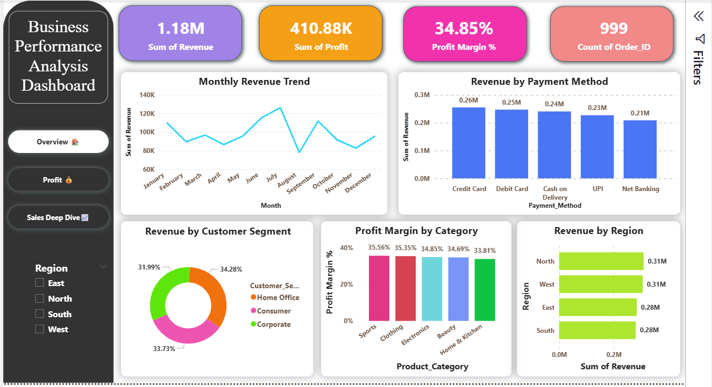
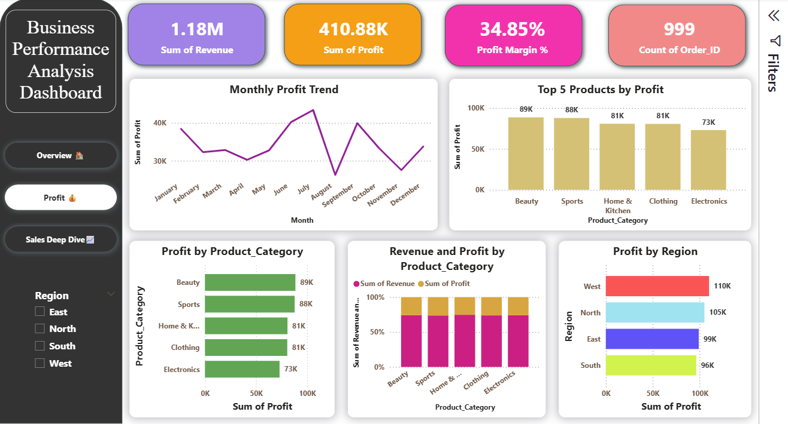
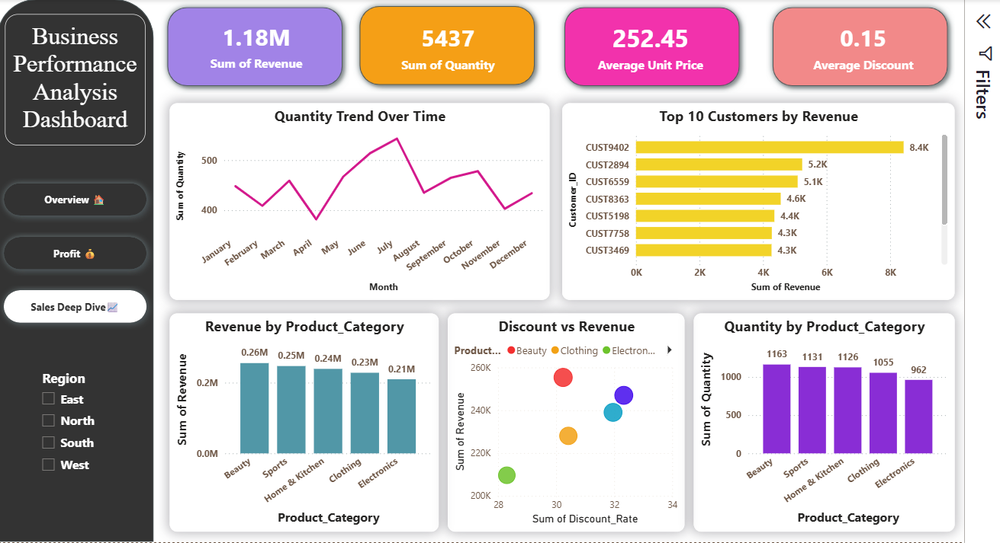

# 📊 Sales Performance Dashboard

An interactive Business Intelligence (BI) dashboard built with **Python**, **Streamlit**, and **Plotly**. This project transforms raw sales data into actionable insights through real-time visualizations.

## ✨ Key Features
* **KPI Tracking**: Instant calculation of Total Revenue, Total Profit, and Profit Margin.
* **Interactive Filters**: Sidebar multiselect to filter all charts by Region.
* **Visual Analytics**:
    * Monthly Revenue Trends (Line Chart)
    * Regional Revenue Distribution (Bar Chart)
    * Top 5 Customers by Value (Bar Chart)
    * Profitability Analysis (Bar Chart)

## 🛠️ Installation & Setup
1. **Clone the repository**:
   ```bash
   git clone <your-repository-link>

   ---

## 📊 Power BI Dashboard
This project includes a comprehensive 3-tab Power BI report.

### 1. Executive Overview

*Key Metrics: Total Revenue ($1.18M), Profit Margin (34.85%), and Regional Sales.*

### 2. Profit Analysis

*Deep dive into category-wise profitability and monthly trends.*

### 3. Sales Deep Dive

*Analyzing customer segmentation, discount impacts, and top performers.*

---

## 🗄️ SQL Analysis
The repository includes `sales_analysis.sql` which contains advanced queries for:
* Monthly Revenue aggregation.
* Category-specific profit margins.
* Customer lifetime value (CLV) ranking.
